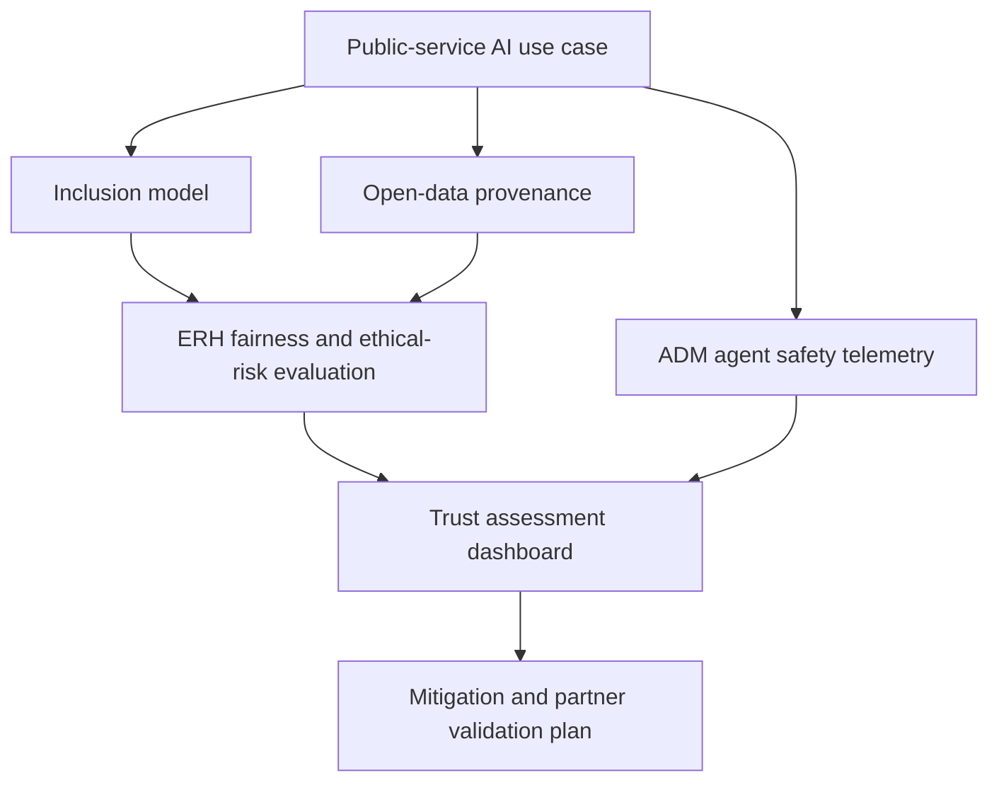

# Architecture

Inclusive AI Trust Gateway has four layers.

## Layer 1: Public-Service Use Case Model

The use case model captures:

- service domain
- target users
- inclusion personas
- barriers and needs
- open data sources
- AI capabilities
- safeguards
- SDG mapping

## Layer 2: ERH Inclusion and Fairness Engine

The ERH integration converts service outcomes into samples that can be evaluated for cumulative ethical-error growth. In the MVP, this is represented by local deterministic scoring. In production, this layer should call `erh_engine` through REST or gRPC.

## Layer 3: ADM Agent Safety Engine

The ADM integration receives safety signals from prompt-injection monitoring, tool-call policy enforcement, session containment, and provenance checks. In the MVP, this is represented by static safety signals. In production, this layer should consume ADM telemetry and session state.

## Layer 4: Human-Readable Trust Assessment

The gateway produces a concise assessment:

- inclusion score
- fairness risk
- open-data readiness
- agent-safety readiness
- known gaps
- next recommended actions

The assessment is meant for public agencies and civic partners, not only technical operators.

