# Architecture

Inclusive AI Trust Gateway composes two real engines — **Ethic-Latex / ERH** (fairness and ethical-risk evaluation) and **Agentic Defense Matrix / ADM** (agent safety telemetry and containment) — behind one Go gateway that exposes the same trust core over seven protocols (REST, WebSocket, Connect-RPC, GraphQL, MQTT, MCP, UCP).

```mermaid
flowchart TB
    subgraph clients["Clients"]
        WEB[apps/web · Next.js on Vercel]
        MOB[apps/mobile · Expo RN]
        AGENT[AI agents · MCP clients]
        SHOP[Shopping agent · UCP]
        IOT[Telemetry publishers · MQTT]
    end

    CF[Cloudflare · DNS / WAF / TLS / rate limits]

    subgraph gw["services/gateway · Go (Choreo container)"]
        REST[REST /v1]
        WS[WebSocket /ws]
        TRPC[Connect-RPC /iatg.v1]
        GQL[GraphQL /graphql]
        MCP[MCP /mcp]
        UCP[UCP commerce module]
        MQ[MQTT transport]
        CORE[CQRS core · commands / queries<br/>DTO → VO → Entity → ViewModel]
        REST --> CORE
        WS --> CORE
        TRPC --> CORE
        GQL --> CORE
        MCP --> CORE
        UCP --> CORE
        MQ --> CORE
    end

    ERH[erh-engine · Python<br/>POST /v1/evaluate · gRPC]
    ADM[adm-gateway + adm-siem · Go<br/>REST :8080 · gRPC :9090]
    REDIS[(Redis 7 · cache + pub/sub)]
    MOSQ[Mosquitto · MQTT broker]
    PG[(Neon Postgres · ent<br/>backup: Supabase)]

    WEB --> CF --> REST
    WEB -.live feed.-> WS
    MOB --> CF
    AGENT --> MCP
    SHOP --> UCP
    IOT --> MOSQ --> MQ

    CORE --> ERH
    CORE <--> ADM
    CORE --> REDIS
    CORE --> PG
    ADM --> REDIS
```

## Layer 1: Clients

- **apps/web** — Next.js dashboard (trust assessments, live safety feed, UCP commerce trace). Typed calls via the generated Connect-RPC TypeScript client, REST fallback, WebSocket for streaming.
- **apps/mobile** — Expo React Native, shares the API client from `packages/shared` (ships post-submission).
- **AI agents** — any MCP client can call `get_assessment`, `evaluate_service`, `list_safety_events`, `check_agent_trust`.
- **Shopping agent (demo)** — transacts over UCP; every call is trust-gated (Layer 3).

## Layer 2: Gateway CQRS Core

One business core, seven thin protocol adapters, written in Go. Requests enter as **Request DTO** structs (go-playground/validator), are dispatched as **Command/Query** objects through a small CQRS bus, touch domain **Value Objects** and ent **Entities**, and exit as **Response DTOs** or UI-shaped **ViewModels**. Cross-cutting concerns are chi middleware: API-key auth, validation, structured logging, recovery, CORS; **webhooks** are HMAC-signed in and out. **Redis** provides the ERH result cache and the pub/sub event bus that fans ADM events out to WebSocket and MQTT subscribers.

## Layer 3: Trust Engines (real containers, no stubs)

- **ERH (`erh-engine`)** — service outcomes are converted to ERH `Sample` records; `POST /v1/evaluate` returns fairness / cumulative-error-growth (α) indicators. Circuit breaker falls back to deterministic local scoring (ported from the original MVP into `packages/shared`) only on outage.
- **ADM (`adm-gateway`, `adm-siem`)** — GHCR images; emits prompt-injection, tool-policy, and containment events into the gateway via webhook (`POST /v1/adm/events`) and MQTT (`adm/events/#`). For the UCP scenario, the gateway registers commerce sessions with ADM so agent drift triggers containment mid-transaction.

## Layer 4: Data

Neon Postgres (ent ORM; pooled TLS connections) holds use cases, personas, assessments, evidence, safety events, commerce sessions/events, and webhook subscriptions. Migrations, roles, and RLS policies live in `infra/database/`; a Supabase Postgres instance is kept schema-identical as a warm backup (nightly dump-restore; failover = env-var swap).

## Layer 5: Edge & Operations

Cloudflare fronts everything (DNS, TLS Full-strict, WAF managed rules, per-path rate limits on `/v1/*`, `/graphql`, `/trpc`, `/mcp`). Three backend containers deploy to Choreo (`trust-gateway`, `adm-stack`, `erh-engine`); Postgres uses Neon (+ Supabase backup); optional Redis/MQTT use managed services. The web app deploys to Vercel. The full stack also runs locally from `infra/docker/docker-compose.yml`, which is what the demo video records.

## Trust Assessment Output

The gateway's product is unchanged from the original concept — a human-readable assessment for public agencies and civic partners:

- inclusion score, fairness risk, open-data readiness, agent-safety readiness
- known gaps and next recommended actions
- now with live evidence attached: ERH evaluation traces and ADM safety events per assessment.
