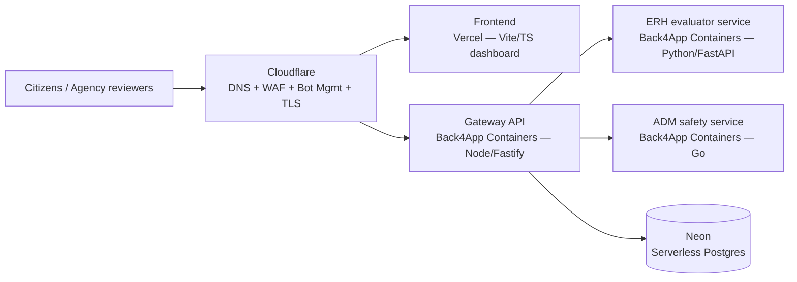

# Inclusive AI Trust Gateway — Implementation Plan

Target competition: **2026 Presidential Hackathon, International Track**
Theme: **Digital Inclusion in the AI Era** (數位共好：打造AI新未來)

Sources inspected:

- `hint.txt` (repo root) — MODA press-release text, submission form fields, and the question of whether ADM and Ethic-Latex fit this hackathon.
- <https://moda.gov.tw/press/press-releases/20076> — MODA call-for-submissions press release.
- <https://presidential-hackathon.taiwan.gov.tw/en/international-track/> — official international-track rules.

---

## 1. Hackathon Constraints That Shape This Plan

| Constraint | Value | Consequence for us |
|---|---|---|
| Submission window | May 22 – **July 31, 2026, 17:00 GMT+8** | All submission-facing work must be demo-ready before July 31, 2026. Today is July 12, 2026 → **~19 days**. |
| Preliminary review | Aug 6–16, 2026 (Feasibility 40%, Innovation 30%, Social Impact 30%) | The submission must show a *working, deployed* demo plus clear inclusion impact. |
| Finals | Late Oct 2026 (adds Implementation 30%) | Post-submission phases target real integration and pilot evidence. |
| Team | 3–10 members, ≥1 non-Taiwan national | Organizational, not technical — track in submission doc. |
| Language | All materials in English | All docs, UI copy, and the demo video in English (zh-TW as secondary locale is a feature, not the default). |

### Are ADM and Ethic-Latex suitable? (question from `hint.txt`)

**Yes — as engines behind one combined proposal, not as two separate entries.**

- **Ethic-Latex / ERH** (`~/Documents/GitHub/Ethic-Latex`, Python: `erh_engine`, `erh_core`, existing `deploy/` + `docker/` assets) provides fairness / ethical-risk / cumulative-error evaluation. Alone it is a research tool — judges would score Social Impact well but Feasibility poorly.
- **Agentic Defense Matrix** (`~/Documents/GitHub/Agentic Defense Matrix (ADM)`, Go: `cmd/`, `pkg/`, `agents/`, `dashboard/`, `docker-compose.yml`) provides AI-agent safety: prompt-injection monitoring, tool-call policy, containment. Alone it is a security product — strong Feasibility, weak fit with the *inclusion* theme.
- **Combined as the Inclusive AI Trust Gateway**, they answer the theme directly: *inclusive* public AI services need both equity auditing (ERH) and operational safety (ADM). This is also exactly how the existing repo scaffold (`adapters/ethic-latex`, `adapters/adm`) is structured.

---

## 2. Target Architecture and Hosting Decisions



| Concern | Decision | Notes |
|---|---|---|
| Frontend | **Vercel** | Existing Vite + TypeScript app in `src/`. Zero-config deploy; preview deployments per PR. |
| Backend API | **Back4App Containers** (`containers.back4app.com`) | Dockerized services; free tier: 0.25 CPU / 256 MB / 100 GB transfer per app — enough for a demo. Each service is its own container app. |
| Relational DB | **Neon** (serverless Postgres) | Interpreting "neo" as **Neon**. If **Neo4j** was intended: Neo4j is a *graph* (non-relational) DB — see §4 discussion before adopting. |
| Non-relational DB | **Not required for MVP** — see §4 | Discuss before adding. |
| DNS / security | **Cloudflare** | Domain control, TLS, WAF managed rules, rate limiting, bot fight mode; FE and API behind proxied CNAMEs. |
| CI / security scanning | **GitHub Actions + GHAS** | CodeQL, secret scanning + push protection, Dependabot, dependency review. |
| E2E / acceptance tests | **Robot Framework** in `tests/` | API suites (RequestsLibrary) + UI smoke suites (SeleniumLibrary), run in CI and against deployed URLs. |

### Services to build

1. **`services/gateway`** (new code, Node 20 + Fastify + TypeScript)
   - Implements the endpoints already reserved in `services/gateway/README.md`:
     - `POST /v1/assessments` — create a trust assessment for a public-service AI use case
     - `GET /v1/assessments/:id` — retrieve assessment + evidence
     - `POST /v1/erh/evaluate` — proxy to ERH service (fallback: local deterministic scoring from `src/app/scoring.ts` ported server-side)
     - `POST /v1/adm/events` — ingest ADM safety events
     - `GET /v1/open-data/readiness` — open-data readiness signals
     - `GET /healthz` — liveness (used by Back4App health checks and Robot tests)
   - Persists to Neon via Prisma (or Drizzle) migrations.
   - Auth for MVP: single agency API key header (`X-Api-Key`), stored as Back4App env var; Cloudflare rate-limits unauthenticated traffic.
2. **`services/erh`** (thin FastAPI wrapper around `erh_engine` from Ethic-Latex; starts as a stub that returns deterministic scores, swapped for the real engine when the Docker image is ready).
3. **`services/adm`** (thin wrapper/exporter that forwards ADM telemetry events; starts as a stub emitting sample safety signals matching `src/app/sampleData.ts`).

> MVP sequencing rule: **gateway with built-in deterministic scoring first** (demoable alone), ERH/ADM containers second. The demo must never depend on an unfinished integration.

### Frontend changes

- Add an API client layer so the dashboard reads assessments from `VITE_API_BASE_URL` when set, falling back to the current local `sampleData.ts` (offline/demo mode).
- English-first UI copy; accessibility pass (keyboard nav, contrast, ARIA landmarks) — this is a *judged feature* under the inclusion theme, not polish.

---

## 3. Data Model (Neon Postgres)

```sql
-- Core tables (managed via Prisma/Drizzle migrations in services/gateway)
use_cases(id, name, domain, description, sdg_tags text[], created_at)
personas(id, use_case_id fk, label, barriers text[], needs text[])
assessments(id, use_case_id fk, inclusion_score int, fairness_risk int,
            open_data_readiness int, agent_safety_readiness int,
            summary text, created_at)
evidence(id, assessment_id fk, source text,          -- 'erh' | 'adm' | 'open-data' | 'manual'
         kind text, payload jsonb, created_at)
safety_events(id, use_case_id fk, event_type text,    -- prompt_injection | tool_policy | containment
              severity text, detail jsonb, received_at)
open_data_sources(id, use_case_id fk, name, url, freshness_days int,
                  has_accessibility_metadata bool, has_multilingual_labels bool)
```

- `jsonb` columns absorb the flexible ERH/ADM payloads — this is the main reason a separate document DB is unnecessary at this scale.

## 4. Non-Relational DB — Discussion Placeholder (decide together)

Not needed for MVP. Revisit only if one of these materializes:

| Trigger | Candidate | Why |
|---|---|---|
| High-volume ADM telemetry streams (finals pilot) | Redis / Upstash or a queue | Postgres inserts per event won't scale past demo volume. |
| Persona/barrier relationship analysis ("which barriers co-occur across services") | **Neo4j (if "neo" meant Neo4j)** | Graph queries over persona–barrier–service networks. This would be *in addition to*, not instead of, Neon. |
| Caching of ERH evaluation results | Cloudflare KV / cache rules | Cheap, no new DB. |

**Decision needed from you:** confirm "neo" = Neon (assumed here) or Neo4j.

## 5. Cloudflare Setup (domain + cybersecurity control)

1. Domain onto Cloudflare (nameservers), DNS records:
   - `app.<domain>` → CNAME to Vercel (proxied)
   - `api.<domain>` → CNAME to Back4App container app (proxied)
2. TLS: Full (strict); HSTS on.
3. WAF: managed ruleset + rule blocking non-`/v1/*` paths to the API host.
4. Rate limiting: e.g. 60 req/min/IP on `/v1/*`; stricter on `POST /v1/assessments`.
5. Bot Fight Mode on; optionally Turnstile on any public form.
6. Security headers via Transform Rules or a Snippet (CSP, X-Content-Type-Options, Referrer-Policy).

## 6. Testing Strategy

### 6.1 Robot Framework (`tests/`)

```text
tests/
+-- requirements.txt            # robotframework, requests, selenium libs
+-- README.md                   # how to run locally and in CI
+-- robot/
    +-- resources/
    |   +-- common.resource     # base URLs, API key, shared keywords
    +-- api/
    |   +-- health.robot        # /healthz liveness         [tag: smoke]
    |   +-- assessments.robot   # CRUD + scoring contract   [tag: api]
    +-- web/
        +-- dashboard_smoke.robot  # dashboard loads, key UI landmarks [tag: ui]
```

- All suites take `BASE_URL` / `APP_URL` as variables → same suites run against `localhost`, Back4App, and the Cloudflare-fronted production URL.
- `smoke` tag = must pass in CI on every push. `api`/`ui` full suites run when the gateway service lands and nightly against staging.
- UI suite uses SeleniumLibrary headless Chrome; API suites use RequestsLibrary.

### 6.2 GHAS (GitHub Advanced Security)

| Control | Mechanism |
|---|---|
| Static analysis | CodeQL workflow — `javascript-typescript` now; add `python`/`go` matrices when those services land |
| Dependency vulnerabilities | Dependabot (`.github/dependabot.yml`) for npm, pip, docker, actions |
| PR-time dependency gating | `dependency-review` workflow on pull requests |
| Secrets | Repo settings: secret scanning + push protection (enable in GitHub UI; free on public repos) |
| Existing CI | Keep `ci.yml` typecheck/build; add Robot smoke job that builds the FE, serves it, runs `smoke`-tagged suites |

## 7. Work Breakdown — Subtasks and Commit Points

Commit after each subtask (repo convention: small, single-purpose commits).

| # | Subtask | Deliverable | Status |
|---|---|---|---|
| 0 | Track hint notes | `hint.txt`, `.gitignore` | ✅ committed |
| 1 | This implementation plan | `docs/dev-plan/implementation.plan.md` | ✅ this commit |
| 2 | Robot Framework test scaffold | `tests/` suites + requirements + README | next commit |
| 3 | GHAS + test CI | CodeQL, Dependabot, dependency-review, Robot smoke workflow | next commit |
| 4 | Gateway API service | `services/gateway` Fastify app + Dockerfile + Prisma schema, deterministic scoring | |
| 5 | Neon provisioning + migrations | Neon project, `DATABASE_URL` in Back4App, first migration applied | |
| 6 | Back4App deployment | Container app for gateway, health checks green, Robot `api` suite passing against it | |
| 7 | FE API integration + Vercel deploy | Dashboard reads live API; `app.<domain>` live | |
| 8 | Cloudflare domain + WAF | DNS, TLS, WAF, rate limits per §5 | |
| 9 | ERH service container | FastAPI wrapper over `erh_engine`; gateway proxies to it | |
| 10 | ADM event ingestion | ADM exporter posts events to `/v1/adm/events`; dashboard shows live safety signals | |
| 11 | Submission package | Updated `docs/hackathon-submission.md`, demo video link, live URL | **before Jul 31** |

Subtasks 4–8 are the July 31 critical path; 9–10 can degrade to stubs if time runs short; 11 is mandatory.

## 8. Secrets and Environment Variables

| Name | Where | Used by |
|---|---|---|
| `DATABASE_URL` | Back4App env | gateway → Neon |
| `GATEWAY_API_KEY` | Back4App env + Vercel env | agency auth |
| `VITE_API_BASE_URL` | Vercel env | FE → API |
| `ERH_SERVICE_URL`, `ADM_SERVICE_URL` | Back4App env | gateway → engines |
| Cloudflare API token | local/CI only | DNS + WAF automation (never committed) |

Never commit secrets; GHAS push protection is the backstop.

## 9. Risks

1. **19-day runway** → deterministic-scoring gateway first; engines are stretch goals.
2. **"neo" ambiguity** → assumed Neon; flag before subtask 5 if Neo4j intended.
3. **Back4App free-tier cold starts / limits** → keep containers small (distroless / alpine); demo video as fallback evidence.
4. **ERH/ADM images are heavyweight** → wrap, don't port; stub interfaces are contract-compatible from day one so swapping is low-risk.
